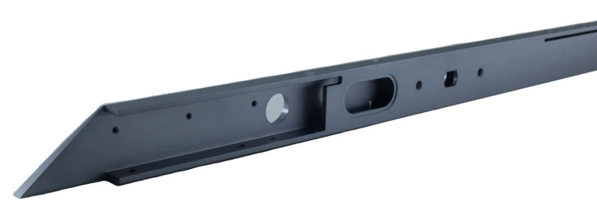
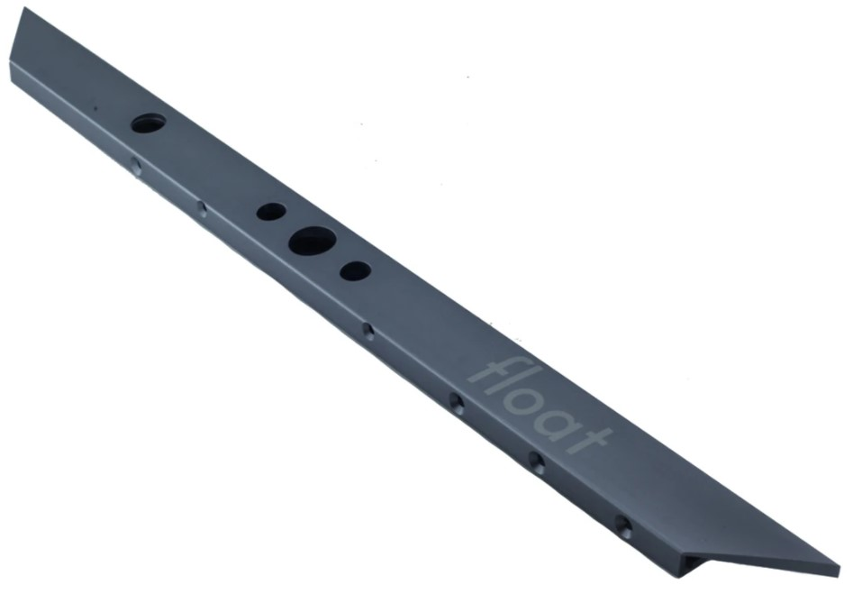
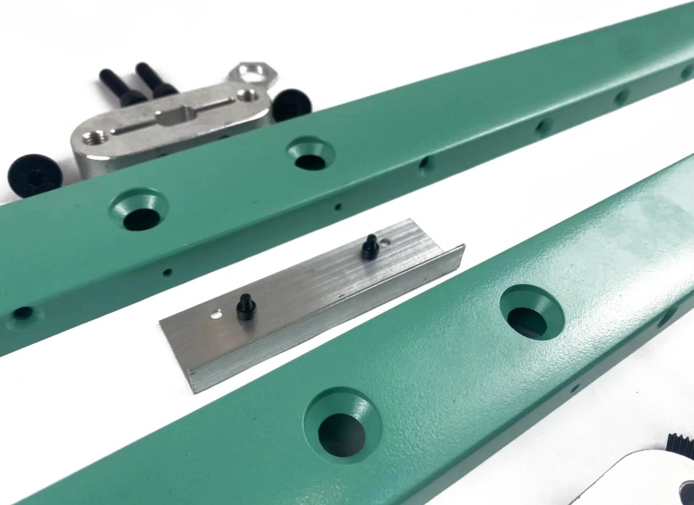
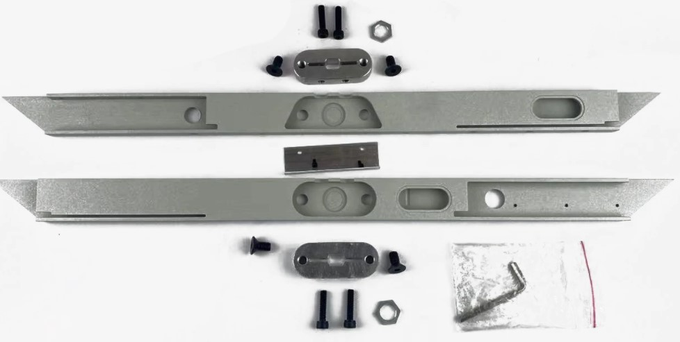
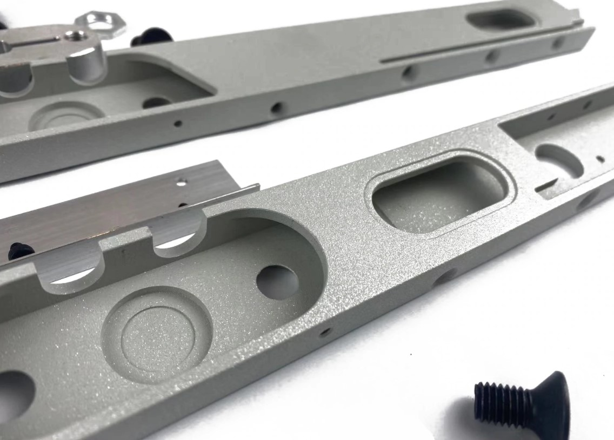
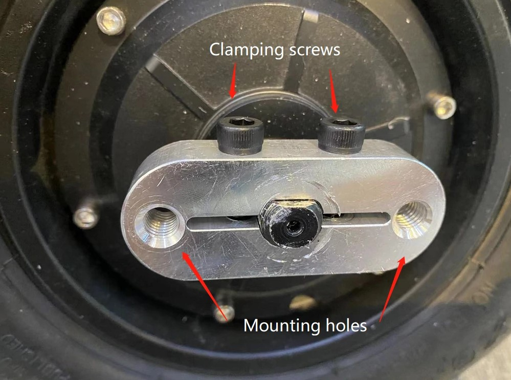
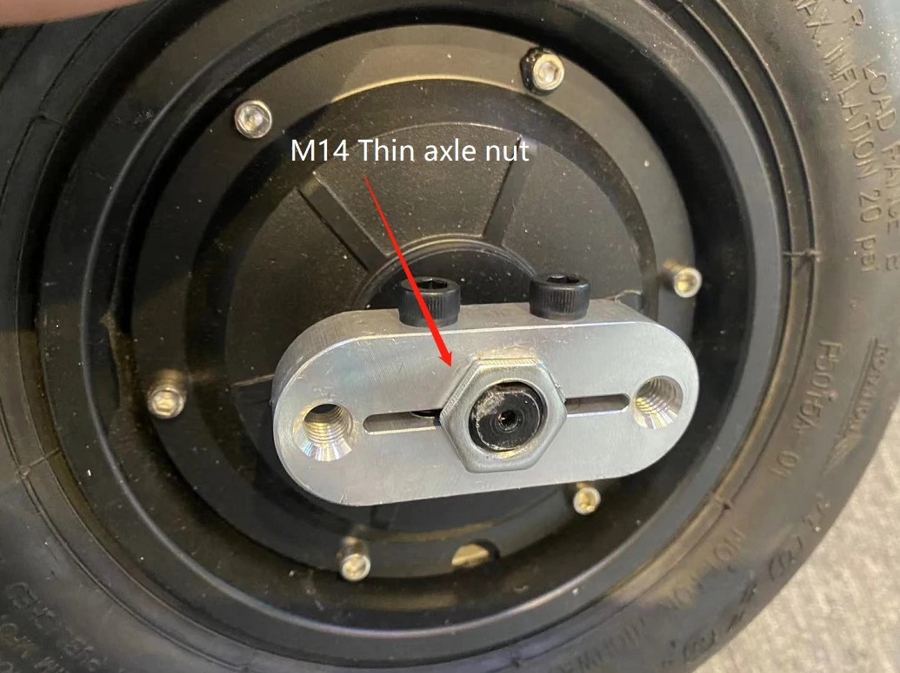
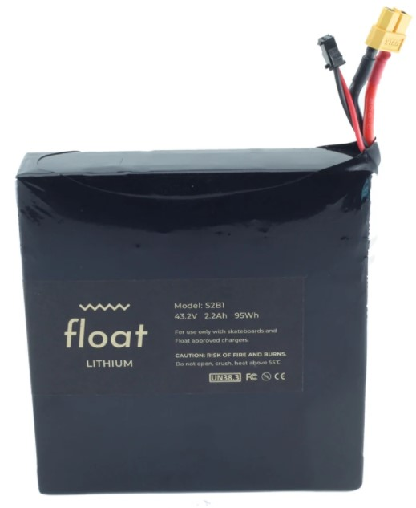

# floatwheel

DIY project similar to floatwheel and onewheel, in collaboration with students at the SSIS.

## Aluminum frame

## Axle holder

## Battery

Should be put all wires outside for the BMS battery management system? 

