# floatwheel

DIY project similar to floatwheel and onewheel

We took some inspiration for the original onewheel and the DIY project floatwheel. There are so many things to consider:

## Aluminum frame

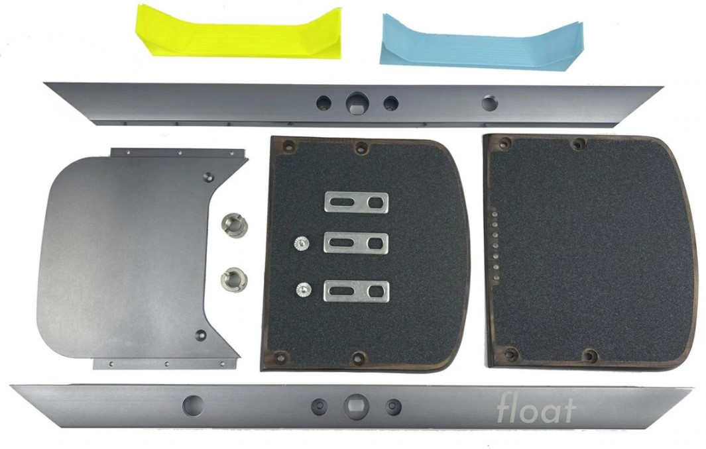

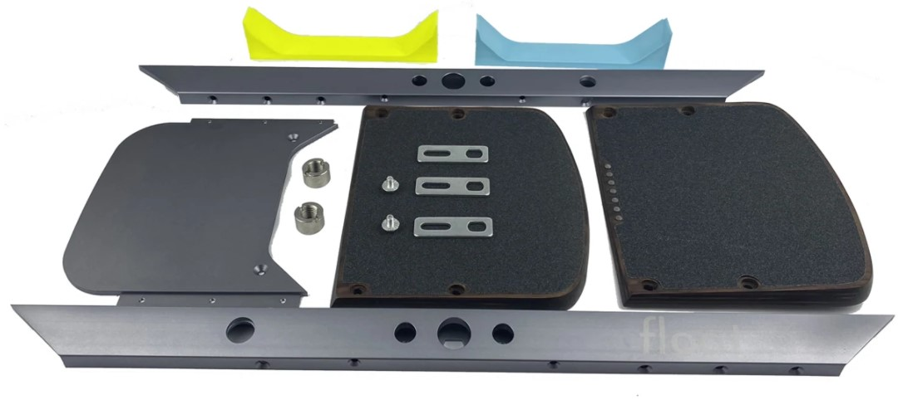

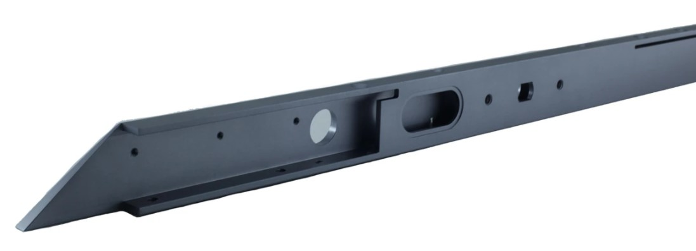

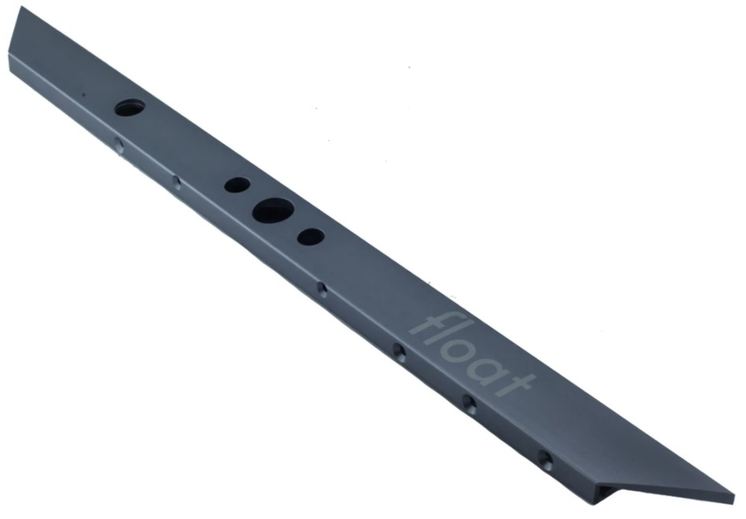

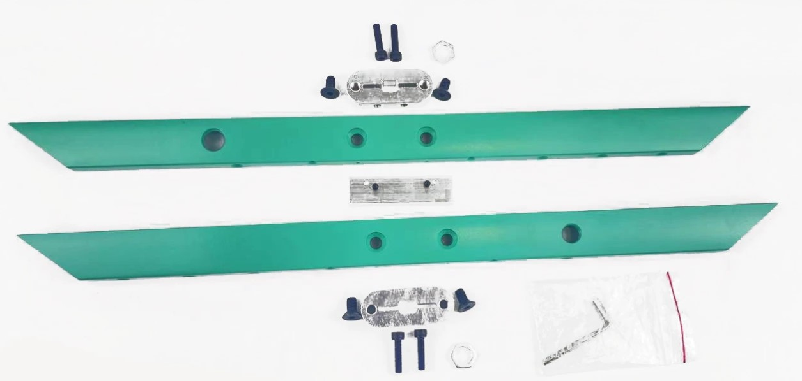

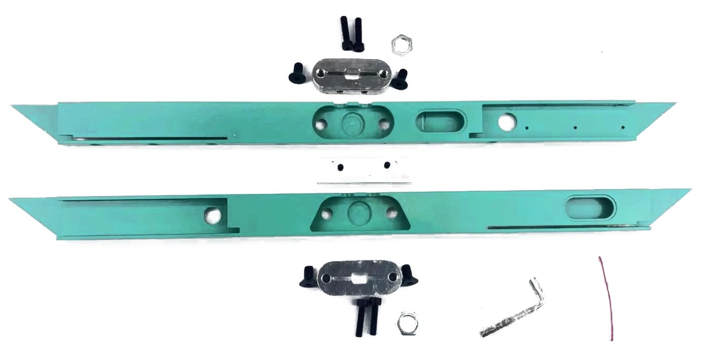

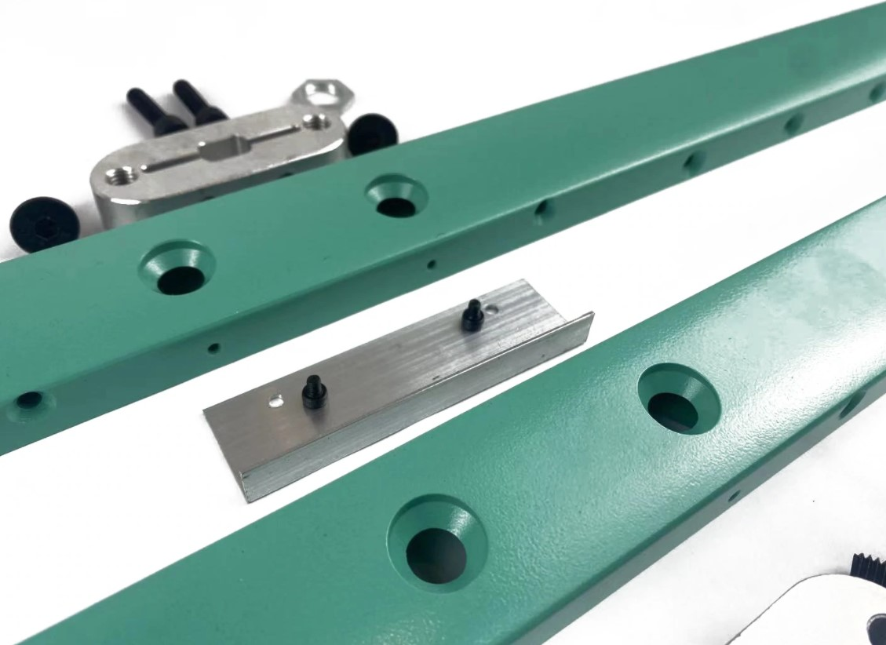

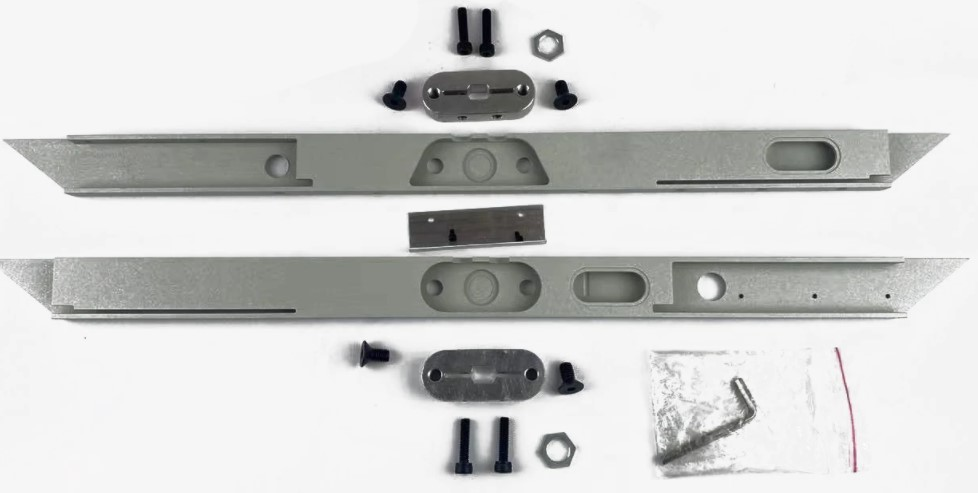

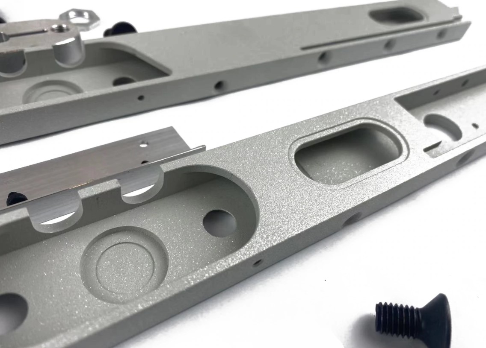

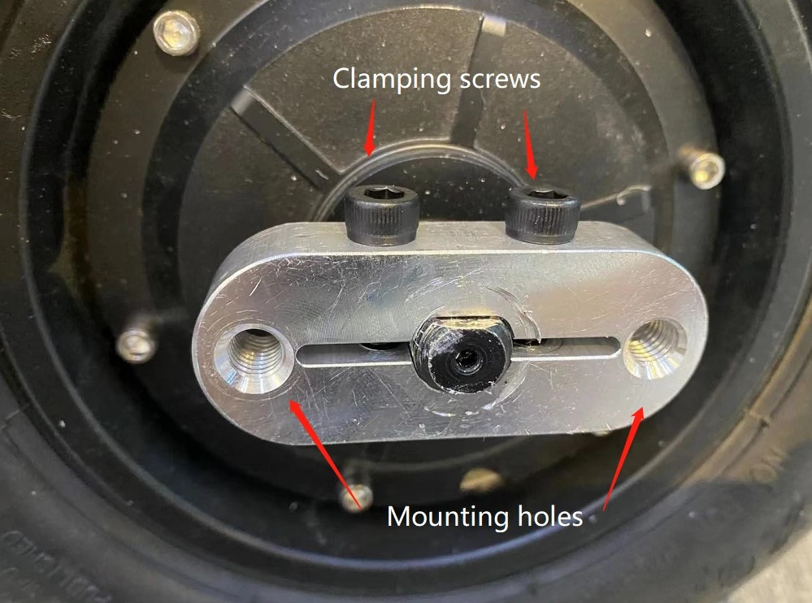

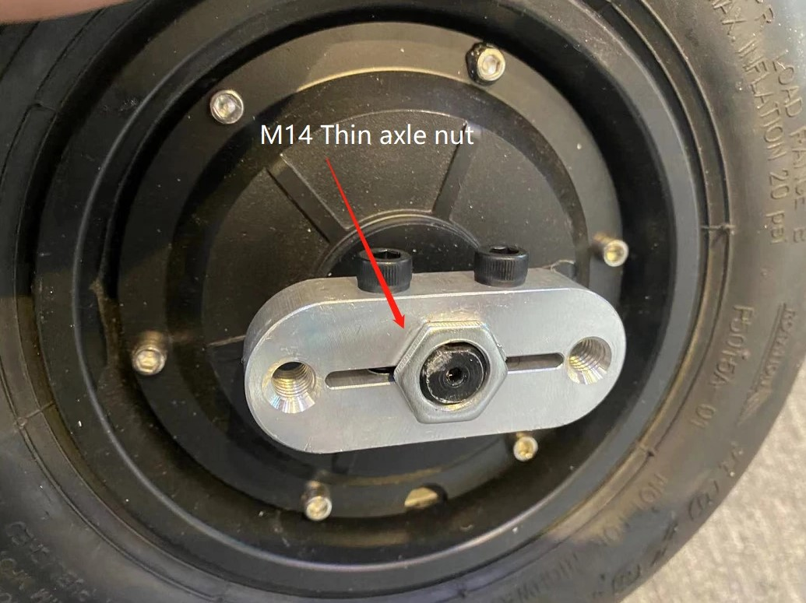

## Battery

Should be put all wires outside for the BMS battery management system? 

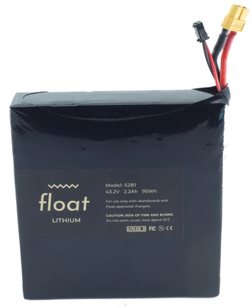

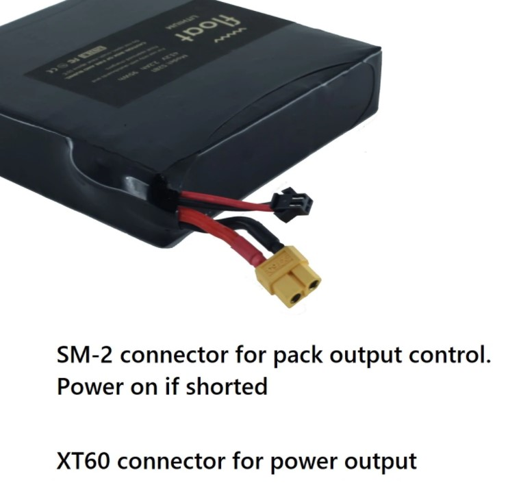
