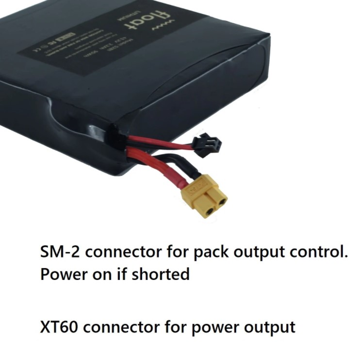

# Battery

We are planning to use 24 NCR18650B Panasonic 3400 mAh battery cells in 12S2P configuration for 44.4 - 50.4 Volt. Inspiration is taken from the floatwheel and onewheel battery.

## Floatwheel

For reference we look at the values from the floatwheel (from [https://floatwheel.com](https://floatwheel.com/collections/battery-packs/products/12s1p-samsung-48g-battery-pack)):

- Comes with free 51V 1.5A charger(made by FM"s supplier)
- This battery pack contains 12 geniune cells of TESLA 2170 cells, in 12S1P configuration.
- In order to safely ship the battery and meet the UN38.3 regulations, and for you to easier carry it on the airplane, the capacity is marked as 95wh on the battery info sticker, there is a program built into the BMS  to limit the battery capacity to 95wh when it gets out of factory, the limitation will be lifted after the battery is charged for the first time. Afterwards, the battery pack will have a capacity of 222wh.

### Features

- Built-in smart BMS
- Automatic balancing cells after pack is fully charged. (60ma balancing currrent) 
- Easily turn on and off the battery pack output via the SM2 control connector.
- Thermal runaway protection.(4 zone temperature monitoring)
- Under voltage protection.
- Overcharge protection

### Specs

- Dimension: 150 x 145 x 29mm
- Weight:850g
- Max. discharge current: 20A
- Typical standard discharge energy: 222Wh
- Max. pulse discharge current: 30A
- Discharge cut-off voltage: 36V
- Operating temperature: Charge: 0° ~50°C, discharge -20°C ~ 60°C
- Cycle life: Capacity drops to 91% after 100 cycles in lab condition(100 cycles is roughly 2000 km of use). Estimated drop to 75% after 500 cycles(500 cycles equals roughly 9000km).Average ODO per year is 900km.

### Construction

The cells are hold in place using 4 plastic holder, then enclosed using 6 pieces of FR4 plate, to prevent sharp things to pierce through, then firmly wrapped using glassfiber reinforced tape, finally covered in 2 layers of heat shrink plastics to have a stong weather proof capability.

### Warranty

The battery pack is backed with 1 year of warrenty against any manufacture defect, any shipping cost of fix or replacement will be paid by us.

### Shipping

The battery pack will be shipped by sea then be delivered by local postal service provider which will take around 40 days to arrive, please order ahead of time so we can arrange the shipping.
